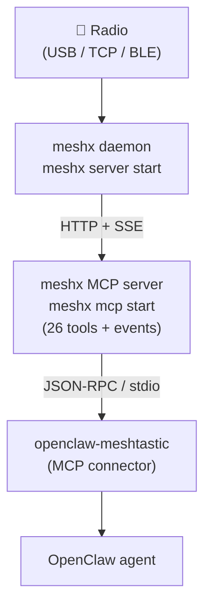

[](LICENSE)
[](https://conventionalcommits.org)


[](https://github.com/tekk/hovnokod-badge)

# openclaw-meshtastic

📡 OpenClaw plugin for Meshtastic LoRa mesh radios via
[meshx](https://github.com/retr0h/meshx).

Connects your OpenClaw agent to the mesh — send messages, manage
channels, scan for radios, ping peers, subscribe to live events.
meshx ships a native
[MCP server](https://github.com/retr0h/meshx#-claude-code--mcp)
with 26 auto-generated tools; this plugin tells OpenClaw how to
spawn it.

## ⚠️ Requires meshx

This plugin does not talk to a radio directly — it connects to the
[meshx](https://github.com/retr0h/meshx) daemon via its MCP server.

```bash
# install meshx
curl -fsSL https://github.com/retr0h/meshx/raw/main/install.sh | sh

# start the daemon — the agent handles radio lifecycle
# (scan, pair, attach) via MCP tools
meshx server start
```

No `--radio` flag needed at startup. The agent discovers and attaches
radios at runtime through `scan_ble`, `scan_usb`, `pair_ble`, and the
rest of the BLE/USB tool surface.

## 🏗️ Architecture



## 🔧 Tools (26)

Auto-generated from the daemon's OpenAPI spec. When meshx adds an
HTTP endpoint and runs `just generate`, the matching MCP tool
appears.

| Category | Tools |
|---|---|
| Discovery | `health`, `list_radios`, `get_radio` |
| Mesh state | `list_channels`, `list_nodes`, `list_messages` |
| Messaging | `send_message` (broadcast + DM via `to_num`) |
| Channels | `mint_channel`, `import_channels`, `delete_channel`, `share_channel` |
| Config | `update_config`, `reboot_radio` |
| Radio ops | `ping_peer`, `traceroute_peer`, `sync_radio` |
| BLE / USB | `scan_ble`, `scan_usb`, `auto_detect_usb`, `pair_ble`, `list_ble_devices`, `forget_ble_device`, `set_ble_favorite`, `clear_ble_favorite` |
| Events | `subscribe_events`, `unsubscribe_events` |

Event subscriptions push live radio events (messages, ack/fail,
peer sightings) as MCP Log notifications — no polling. Per-radio
or unified (all radios). Resumable via `since` cursor.

## 📦 Install

### Option 1 — register the MCP server directly

No plugin install needed:

```bash
openclaw mcp set meshx '{"command":"meshx","args":["mcp","start"]}'
```

Tools appear as `meshx__send_message`, `meshx__list_radios`, etc.

### Option 2 — ClawHub bundle

```bash
openclaw plugins install clawhub:openclaw-meshtastic
openclaw gateway restart
```

The bundle ships `.mcp.json` — embedded Pi spawns
`meshx mcp start` when the bundle is enabled.

### Option 3 — from source

```bash
git clone https://github.com/retr0h/openclaw-meshtastic.git
cd openclaw-meshtastic
npm install && npm run build
openclaw plugins install .
openclaw gateway restart
```

## ⚙️ Configure

### MCP server (Option 1)

Pass daemon URL + auth via env:

```bash
openclaw mcp set meshx '{
  "command": "meshx",
  "args": ["mcp", "start"],
  "env": {
    "MESHX_MCP_SERVER": "http://192.168.1.10:4404",
    "MESHX_MCP_AUTH_TOKEN_FILE": "/path/to/token"
  }
}'
```

Defaults: `http://127.0.0.1:4404`, no auth (loopback).

### Plugin bundle (Option 2 / 3)

In `openclaw.json` under `plugins.entries.meshtastic.config`:

```jsonc
{
  "baseUrl": "http://127.0.0.1:4404",
  "defaultRadioId": null,
  "timeoutMs": 5000
}
```

## 📚 Docs

- [meshx docs](https://github.com/retr0h/meshx/tree/main/docs) — daemon setup, keybindings, architecture
- [meshx configuration](https://github.com/retr0h/meshx/blob/main/docs/configuration.md) — every flag / env / default
- [MCP pivot design](docs/design-mcp-pivot.md) — original architecture notes

## 📄 License

MIT — see [LICENSE](./LICENSE).
